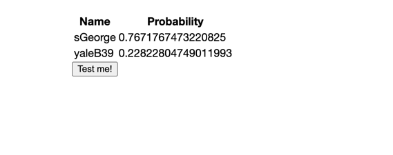

# **Neural Network enforced login:**

Network used with transfer learning and reinforcement learning.
Model used is Resnet50 taken from the package tensorflow.keras.applications.resnet50

The network model architecture is a Sequential keras model and the layers are presented as the following:

 1. resnet50 (Functional)       (None, 7, 7, 2048)        23587712  

 2. flatten (Flatten)           (None, 100352)            0         
                                                                 
 3. dropout (Dropout)           (None, 100352)            0         
                                                                 
 4. dense (Dense)               (None, 512)               51380736  
                                                                 
 5. dense_1 (Dense)             (None, 256)               131328    
                                                                 
 6. dense_2 (Dense)             (None, 128)               32896     
                                                                 
 7. dense_3 (Dense)             (None, 29)                3741      
                                                                 
=================================================================\
Total params: 75,136,413\
Trainable params: 51,548,701\
Non-trainable params: 23,587,712
_________________________________________________________________

where the 'net' parameter stands for the resnet

[ResNet](https://www.tensorflow.org/api_docs/python/tf/keras/applications/resnet)

To do List:

* Check predictions of neural network and retrain it if necessary
    1. Add admin account and password with admin login credentials

    2. Add train method so when a new employee is added, the training can begin and the next day, it will be available.
        * Idea: Here it would be better to always have the trained model in a backup and a way for the admin to swap it. Like, new version is available, please select it.
        * Create workflow maybe to have it swapped? (Unnecessary)

The sandbox page is working and showing all predictions over 1% probability.

The out of the box url is localhost:8080/sandbox.html.

Example of the sandbox prediction